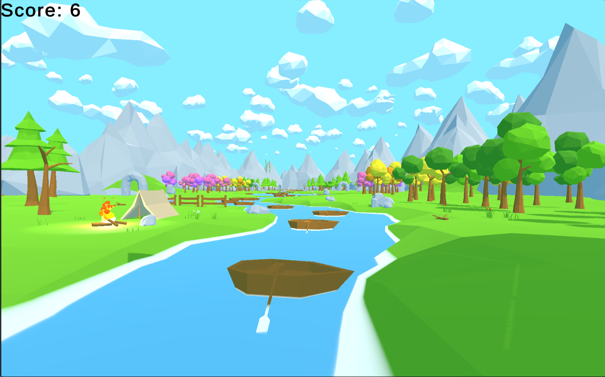

<p align="center">
  
</p>

# 🚤 Boat Breaker

**Boat Breaker** is a stylized 3D axe-throwing game developed in Unity as part of a Game Development course project. Inspired by the mechanics of *Smash Hit*, this game lets players launch axes at boats gliding through a serene, low-poly environment — break as many as you can before they pass!

---

## 🎮 Gameplay Overview

- Choose from **3 distinct axe weapons**, each with unique visual style.
- Play across **2 beautifully crafted stages**:
  - 🌞 **Day Stage** – bright and cheerful
  - 🌙 **Night Stage** – calm and mysterious
- The camera follows a left-to-right **looping cinematic path**.
- Players **tap or click** anywhere on the screen to **throw axes** at incoming boats.
- The main objective is to **smash as many boats as possible** for a high score.

---

## 🕹️ Controls

| Action             | Input                |
|--------------------|----------------------|
| Throw Axe          | Mouse Click / Tap    |
| Switch Weapon      | UI Button Based      |
| Pause Game         | UI Button Based      |

---

## 🛠️ Features

- 🪓 **Three Axe Types** – each with different visual flair.
- 🌄 **Day and Night Levels** – offering two unique atmospheres.
- 🛶 **Particle System** – keeps gameplay engaging.
- 🧭 **Auto-Moving Camera** – keeps players on their toes.
- 🌿 **Low-Poly Visuals** – optimized, minimal, and beautiful.
- 🔊 **Sound FX** – immersive audio for throws and hits (if implemented).

---

## 🔧 Technologies Used

- **Game Engine**: Unity 3D
- **Language**: C#
- **Version Control**: Git + GitHub
- **Target Platform**: Windows, Android & WebGL (expandable)

---

## 🧠 Inspiration

This project was heavily inspired by *Smash Hit*, a game that impressed with its physics-based throwing mechanic and immersive mood. Boat Breaker adapts that concept into a new setting — instead of glass, you destroy boats using medieval axes!

---

## 🧑‍💻 Development Info

- **Developer**: Muhammad Usman Butt
- **Project Type**: University Course Project (Game Development)
- **Development Time**: ~1-2 weeks

---

## 📝 How to Play (in Editor)

1. Clone the repository.
2. Open the project in [Unity Hub](https://unity.com/download).
3. Make sure dependencies are resolved.
4. Press `Play` in the Unity Editor to test the game.

```bash
git clone https://github.com/usmanbutt-dev/boat-breaker.git
