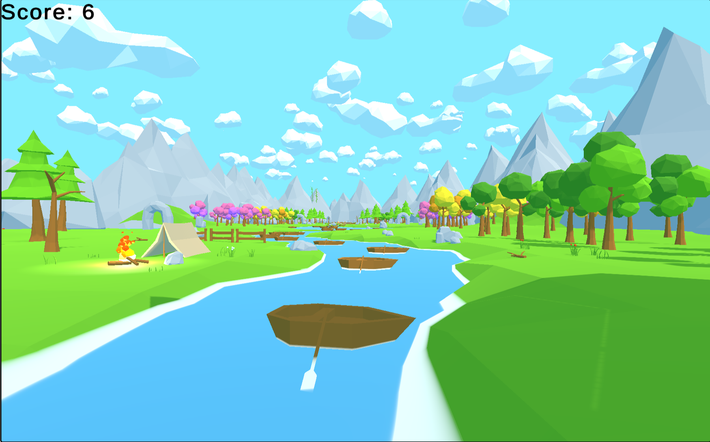

# Boat Breaker

<p align="center"></p>

A Unity browser game about throwing axes at passing boats. Built as a university game development project.

**[Play the browser demo](https://usmanbutt-dev.github.io/boat-breaker/)**

## Play

Click or tap to throw an axe. Use the on-screen controls to switch weapons or pause. The game includes three axe styles and day and night stages; the goal is to break as many boats as possible.

## Run locally

This repository contains the exported WebGL build. Serve the repository folder over HTTP, then open it in a browser:

```sh
python -m http.server 8000
```

Open `http://localhost:8000/`. The export loads from `index.html`, `Build/`, and `TemplateData/`. The playable Unity project is not included in this repository.
